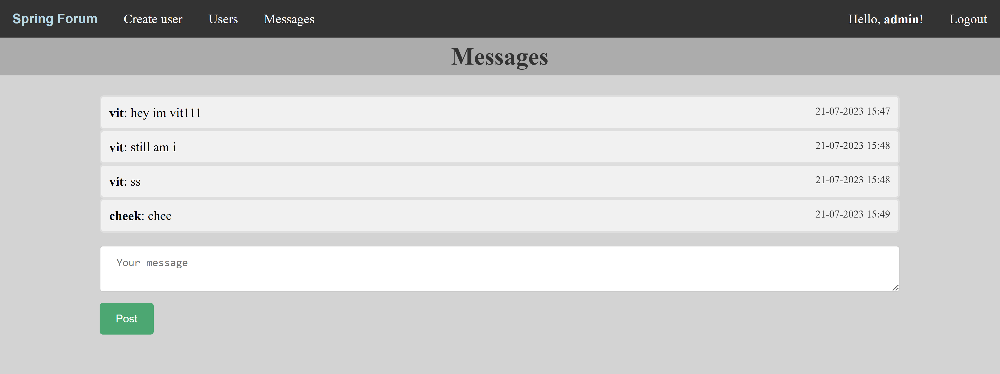

# SpringForum

This is a simple web chat. 
It uses Spring MVC XML config, Hibernate, Thymeleaf, JPA, Spring Security, OAUTH 2.0, slf4j, log4j2, Lombok, MySQL, Jackson.

## Prerequisites

1. Java 18+;
    * I have `java 19.0.2`.
2. MySQL server;
    * No explicit database initialization is needed;
    * Make sure you don't have anything important in db with name `springforum`.

## How to run

1. Run MySQL server: `Win+R -> mysqld --console`
2. Set `OAUTH_CLIENTID` and `OAUTH_CLIENTSECRET` system environment variables;
    * You can get them here: https://console.cloud.google.com/apis/credentials
        You may need this settings to create new OAuth 2.0 Client ID:
        * `Authorized JavaScript origins` = `http://localhost:8080`
        * `Authorized redirect URIs` = `http://localhost:8080/login/oauth2/code/google`

    * In **Powershell** syntax is: `$env:OAUTH_CLIENTSECRET = 'blablabla'` `$env:OAUTH_CLIENTID = 'fake'`
    * You can set those variables to random values, webapp will still work, but registration/login with Google wouldn't be available.
3. In project's root directory execute: `mvn clean jetty:run`
4. Visit http://localhost:8080

## Possible Usage

1. Login as `admin` `qwerty`;
2. Post a new message;
3. Click on your name in top right corner, change your name to anything else;
   * Name under your existing message will be changed too;
4. Create new user at http://localhost:8080/createUser
5. Examine list of users at http://localhost:8080/users
6. Logout and login with your google account.

